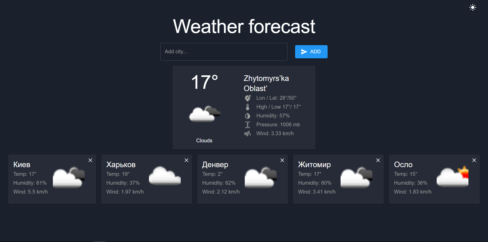

# Weather Ract Redux

[](https://nodejs.org/en/) [](https://www.typescriptlang.org/) [](https://pt-br.reactjs.org/) [](https://redux.js.org/) [](https://axios-http.com/ptbr/docs/intro)

A weather forecast query tool via API with React/Redux/Typescript/Axios


 <p align="center">
  <a src="#" target="_blank"></a>
</p>

## 👊🏻 Thanks before starting...

This project was created using the free Open Weather API:

+ https://openweathermap.org/api

## ❓ Purpose of the project

This Project was created as a test task. It also helped me improve my hard skills

## 🚀 Let's start?

If you want to test this project, follow the steps below!

+ First clone this repository

```jsx
git
clone
https://github.com/ualexzt/
```

+ Enter the weather-widget folder

```jsx
cd
weather - widget
```

+ Run npm install to install dependencies

```jsx
npm
install
```

+ Run npm run dev to run the project at http://localhost:3000/

```jsx
npm
start
``` 

+ If you want to build the project

```jsx
npm
run
build
``` 
